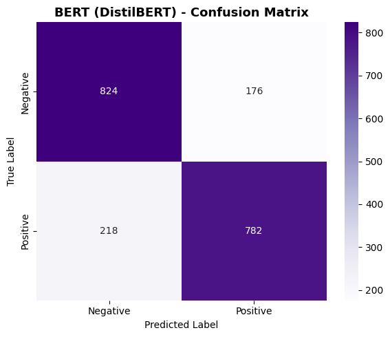
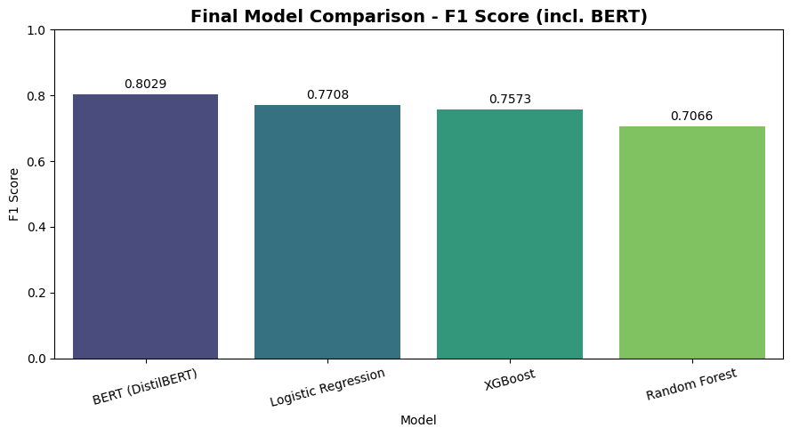

# Twitter Sentiment Analysis with BERT and Power BI

This project analyzes tweet sentiment using the Sentiment140 dataset. It includes data preparation, NLP preprocessing, machine-learning model comparison, BERT-based classification, visual evaluation, and a Power BI reporting workflow.

## Project Highlights

- Cleaned and prepared Sentiment140 tweet data for NLP analysis.
- Converted raw CSV data to Parquet for faster processing.
- Built and compared multiple sentiment classifiers:
  - Logistic Regression
  - Random Forest
  - XGBoost
  - BERT / DistilBERT
- Evaluated models using accuracy, precision, recall, F1 score, and confusion matrices.
- Created a Power BI dashboard workflow for reporting.
- Documented the full data pipeline architecture.

## Final Model Comparison

| Model | F1 Score |
|---|---:|
| BERT / DistilBERT | 0.8029 |
| Logistic Regression | 0.7708 |
| XGBoost | 0.7573 |
| Random Forest | 0.7066 |

## BERT Confusion Matrix

## Final Model Ranking

## Data Pipeline Architecture

## Repository Files

- `twitter_sentiment_project.ipynb` - Main Jupyter notebook for data cleaning, preprocessing, model training, and evaluation.
- `Final Documentation.pdf` - Final project documentation.
- `_bert_confusion.png` - BERT confusion matrix visualization.
- `_bert_f1_ranking.png` - Final model comparison chart.
- `Twitter Sentiment Analysis Data Pipeline Architecture.drawio.png` - Data pipeline architecture diagram.
- `training.1600000.processed.noemoticon.csv.zip` - Compressed Sentiment140 dataset file, included because it is under GitHub's 100 MB file limit.

## Large Files Not Included

The following local files were not uploaded because they are larger than GitHub's normal 100 MB file limit:

- `Twitter_Sentiment_Analysis.pbix`
- `training.1600000.processed.noemoticon.parquet`
- `training_1600000.parquet`

These files can be regenerated from the notebook or stored separately using Git LFS, cloud storage, or Power BI workspace export if needed.

## Tools and Libraries

- Python
- Pandas
- NumPy
- Matplotlib
- Seaborn
- scikit-learn
- XGBoost
- Transformers / DistilBERT
- Power BI

## Dataset

This project uses the Sentiment140 dataset, which contains labeled tweets for sentiment classification. The original dataset labels negative tweets as `0` and positive tweets as `4`.

## Author

Renu Bala
